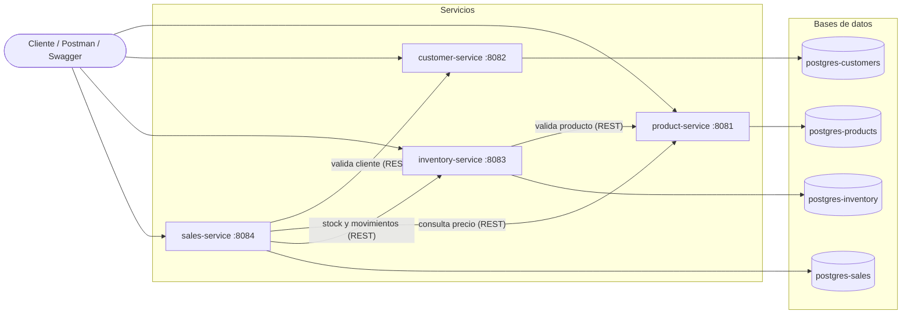
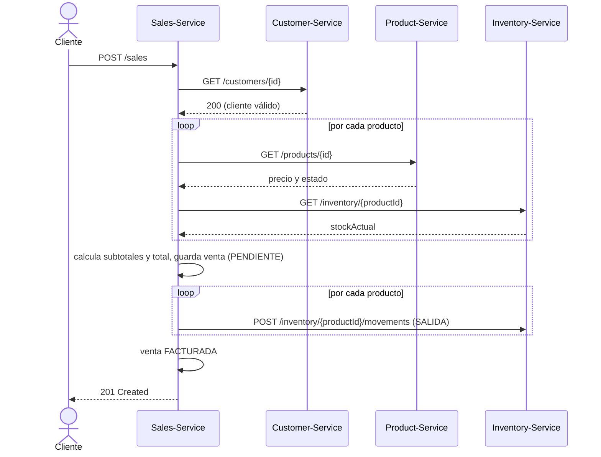
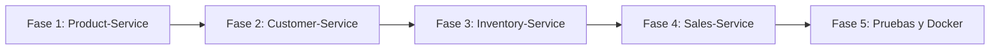

# Arquitectura general

```mermaid
flowchart LR
    Cliente([Cliente / Postman / Swagger])

    subgraph Servicios
        PS[product-service :8081]
        CS[customer-service :8082]
        IS[inventory-service :8083]
        SS[sales-service :8084]
    end

    subgraph Bases de datos
        DBP[(postgres-products)]
        DBC[(postgres-customers)]
        DBI[(postgres-inventory)]
        DBS[(postgres-sales)]
    end

    Cliente --> PS
    Cliente --> CS
    Cliente --> IS
    Cliente --> SS

    IS -- "valida producto (REST)" --> PS
    SS -- "valida cliente (REST)" --> CS
    SS -- "consulta precio (REST)" --> PS
    SS -- "stock y movimientos (REST)" --> IS

    PS --> DBP
    CS --> DBC
    IS --> DBI
    SS --> DBS
```

# Secuencia del flujo de venta

```mermaid
sequenceDiagram
    actor C as Cliente
    participant S as Sales-Service
    participant CU as Customer-Service
    participant P as Product-Service
    participant I as Inventory-Service

    C->>S: POST /sales
    S->>CU: GET /customers/{id}
    CU-->>S: 200 (cliente válido)
    loop por cada producto
        S->>P: GET /products/{id}
        P-->>S: precio y estado
        S->>I: GET /inventory/{productId}
        I-->>S: stockActual
    end
    S->>S: calcula subtotales y total, guarda venta (PENDIENTE)
    loop por cada producto
        S->>I: POST /inventory/{productId}/movements (SALIDA)
    end
    S->>S: venta FACTURADA
    S-->>C: 201 Created
```

# Secuencia de aprendizaje por fases

```mermaid
flowchart LR
    F1[Fase 1: Product-Service] --> F2[Fase 2: Customer-Service]
    F2 --> F3[Fase 3: Inventory-Service]
    F3 --> F4[Fase 4: Sales-Service]
    F4 --> F5[Fase 5: Pruebas y Docker]
```
